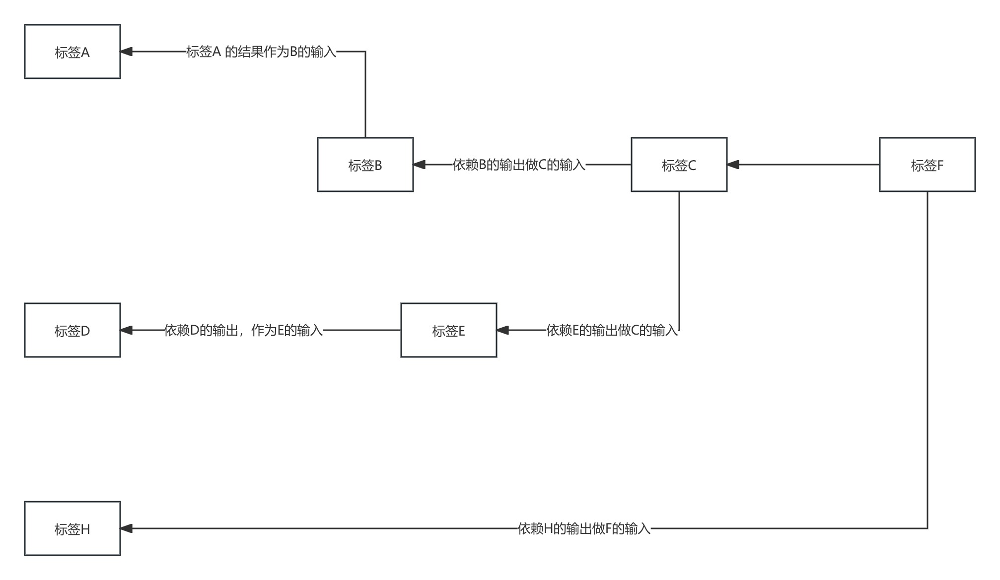

# 项目说明

在任务类型，规则引擎等系统中，通常需要计算指标（变量），再根据变量做业务规则判断
### * 银行贷款的收入认定：涉及到人行贷款，借记卡消费，信用卡消费，社保基数等数据
### * 任务类的系统中，比如充值奖励，入金，出金，净入金，过去7天的交易金额等指标
### * 将任务指标进行拆分，直到不能进一步拆分，拆分的过程得到依赖关系，构建有向无环图
### * 如果运行只需要标签C，那么还需要计算A,B，D，E; 而F,H 是不需要计算的，需要根据参数选择需要执行的逻辑

## 测试用例
[DirectedAcyclicGraphTest.java](src/test/java/com/tk/template/graph/DirectedAcyclicGraphTest.java)

## 有向无环图的实现
[DirectedAcyclicGraph.java](src/main/java/com/tk/template/graph/DirectedAcyclicGraph.java)